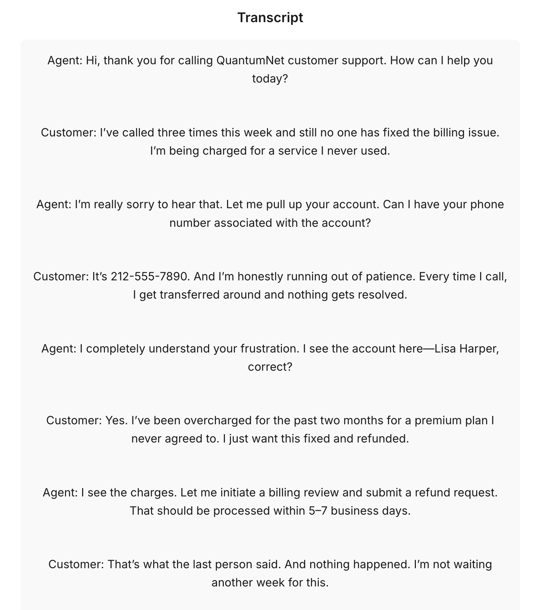

# AI-Powered Call Center Intelligence

A full-stack, local-first behavioral intelligence engine for telecom support calls.

Combining Whisper transcription, GPT-3.5 insights (affordable token cost), PII redaction, and visual analytics — this project gives supervisors real-time understanding of what customers feel, need, and signal during calls.

---

## ✅ Use This If You Need:

- Real-time speech-to-text pipelines that actually work
- Churn risk, emotional escalation, and issue classification — extracted live
- Upload audio **or** raw transcripts, get clean insights
- Resolution tactic suggestions tailored by behavioral trajectory
- Open architecture — no Azure, no Power BI
- UI designed to be *user-mesmerizing*, built with **React + TypeScript**

---

## 🔍 What It Does

1. **Transcribes** calls with OpenAI Whisper
2. **Redacts** PII with spaCy + Presidio
3. **Analyzes** behavior with GPT-3.5 customized prompts (cheaper tokens, just as effective)
4. **Detects** sentiment with HuggingFace models
5. **Visualizes** post-call trends via DuckDB + Altair
6. **Delivers** results in-browser with a fast, styled React frontend

---

## 🏛️ Architecture

```bash
AI-Powered-Call-Center-Intelligence/
├── backend/                # Core logic: FastAPI, Whisper, GPT, redaction
│   ├── main.py             # FastAPI app entrypoint
│   ├── whisper_transcribe.py
│   ├── pii_redaction.py
│   ├── gpt_analysis.py
│   ├── sentiment_analysis.py
│   ├── utils.py
│   └── models/
│       ├── telecom_prompt.txt
│       ├── system_prompt.txt
│       └── pii_labels.yaml
│
├── frontend/               # React frontend (create-react-app + TypeScript)
│   ├── public/
│   └── src/
│       ├── App.tsx
│       ├── TextUpload.tsx
│       └── App.css
│
├── analytics/              # Post-call analytics and dashboards
│   ├── call_summary.db
│   ├── duckdb_loader.py
│   ├── analysis_notebook.ipynb
│   └── powerdash_components.py
│
├── data/                   # Sample data files
│   ├── transcript.json
│   ├── pii_output.json
│   ├── gpt_output.json
│   └── audio_sample.wav
│
├── config/                 # Configs and environment settings
│   └── settings.yaml
│
├── tests/                  # Unit tests for pipelines
│   ├── test_transcribe.py
│   ├── test_gpt_prompt.py
│   └── test_redaction.py
│
├── .env                    # Put your .env with your OpenAI key here
├── run_app.sh              # CLI launcher for backend
├── requirements.txt
└── README.md
```

---

## ✨ Features

- Upload audio or text — get structured insights 
- Backend includes hooks for real-time call ingestion (e.g. Twilio, voice APIs)
- Emotional arc detection (e.g., Calm → Angry)
- Tactic recommendation engine using structured GPT prompting
- PII masking that preserves useful metadata (e.g. phone/account)
- Sentiment over time + issue heatmaps in notebook
- Fully local: no cloud services required

---

## 🧠 Prompt Logic (telecom_prompt)

```
Analyze the following telecom customer service call and extract:

1. Core issue reported by the customer
2. Classification: Billing, Connectivity, Retention, Inquiry, Cancel
3. Agent resolution steps taken
4. Customer satisfaction at end
5. Was follow-up promised?
6. List any PII mentioned
7. Emotional tone progression
8. Churn risk
9. Recommended resolution tactic
```

---
## 🖼️ Example Output

Here’s a sample of what you’ll see after analyzing a call:




---

## ⚡ Live UI (localhost)

- Built with React + TypeScript, styled to be clean and user-friendly
- Upload panel: audio file → transcript → insights
- Text panel: paste a transcript → get analysis
- Outputs display with JSON structure and preformatted blocks

---

## 📊 Post-Call Analytics

- View post-call analytics via Jupyter dashboards (Altair + DuckDB)
- In-memory or persistent call storage
- Charts include:
  - Emotional progression
  - Resolution tactic frequency
  - Satisfaction distribution
  - Issue heatmap

---

## 🧩 No Azure or Power BI Required

This is a **standalone**, open-source version of Microsoft’s call intelligence accelerator:

- Uses Whisper + GPT-3.5 from OpenAI
- All redaction and classification handled locally
- No subscriptions, no vendor lock-in

---

## 🔌 Requirements

**Python 3.10.13**

This project uses **Python 3.10.13** for maximum compatibility with legacy OpenAI libraries (`openai==0.28.0`) and NLP tools like `whisper`, `presidio`, and `torchaudio`, which do not fully support Python 3.11+.

Python 3.10.13:
- Works reliably with `torch`, `torchaudio`, `keras==2.6.0`, and Whisper
- Avoids dependency issues with `presidio`, `spacy`, and `openai==0.28.0`(which works with the chatgpt 3.5 model, which has cheaper token use than more newer models)
- Used as the target version throughout development

I recommend [pyenv](https://github.com/pyenv/pyenv) to install Python 3.10.13 locally:

```bash
pyenv install 3.10.13
pyenv local 3.10.13
```
Install all Python dependencies:

```bash
pip install -r requirements.txt
```

Or install them manually:

```bash
pip install fastapi==0.111.0
pip install uvicorn==0.19.0
pip install python-dotenv==1.0.1
pip install openai==0.28.0
pip install git+https://github.com/openai/whisper.git
pip install spacy==3.7.5
pip install presidio-analyzer
pip install presidio-anonymizer
pip install torchaudio==2.0.2
pip install transformers
pip install pandas==1.5.3
pip install duckdb
pip install altair
pip install jupyter
pip install scikit-learn
pip install requests
pip install pathlib
pip install keras==2.6.0
pip install streamlit
```

Then add a `.env` file in the project root:

```env
OPENAI_API_KEY=sk-xxxxx
```

If you're using pipenv instead of pip:

```bash
pipenv install
```

Make sure `python --version` returns `3.10.13` inside your environment.

---

## 🚀  Running the App

### 1. Start the backend (FastAPI)

```bash
uvicorn backend.main:app --reload --port 8001
```

> ℹ️ We use port `8001` instead of the default `8000` to avoid conflicts with React’s dev server or background processes.

---

### 2. Start the frontend (React + TypeScript)

```bash
cd frontend
npm install
npm start
```

Then open your browser at: [http://localhost:3000](http://localhost:3000)

---

### ✅ Configure frontend to talk to backend

Make sure your React frontend points to `http://localhost:8001`.  
Example in your fetch call:

```ts
const response = await fetch('http://localhost:8001/analyze-text', {
  method: 'POST',
  body: formData,
});
```

---

## 📝 License

MIT © 2025
